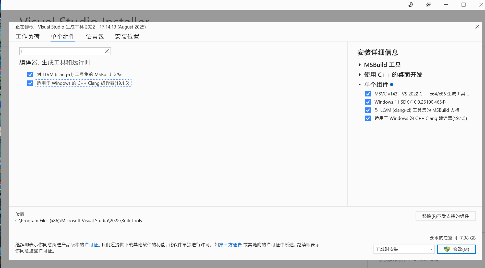
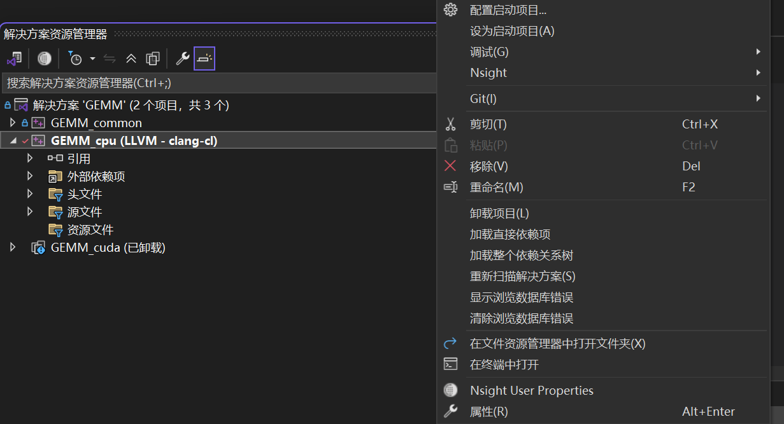

# 基于OpenMP的GEMM实现

## 1目標

GEMM（General Matrix to Matrix Multiplication，通用矩阵乘法）在线性代数、机器学习、统计学和许多其他领域中扮演关键角色。本文通过实现朴素GEMM、调整循环次序、基于OpenMP的优化等多个方法，来加深对GEMM各种优化算法的理解。

具体，给定三个矩 A(形状MxK维度），B（形状KxN)和C(形状MxN).同时提供了两个幅度变化标量 α 和 β，通过如下的公式计算结果矩阵C以实现类似神经网络中一层处理的线性操作：C = α×A×B + β×C。A和B按照标准矩阵乘法操作，即A的第i行和B的第j列对应的元素相乘求和，得到C的（i,j)坐标处的元素。计算完毕后使用α放缩，再加上C放缩β倍的这个偏置量。

## 2算法实现

### 2.1 调整k-循环位置

调整K-循环后的GEMM
```
void GEMM_serial::change_loop_order(const float* vMatrixA, const float* vMatrixB, float* vMatrixC, size_t vM, size_t vN, size_t vK, float vAlpha, float vBeta, const std::any& vCustomParam)
{
//todo: add your code here
    for (size_t i = 0; i < vM; ++i) {
        for (size_t j = 0; j < vN; ++j) {
            vMatrixC[i * vN + j] *= vBeta;
        }
    }
    for (size_t k = 0; k < vK; ++k) {
        for (size_t i = 0; i < vM; ++i) {
            const float a_ik = vMatrixA[i * vK + k];
            for (size_t j = 0; j < vN; ++j) {
                vMatrixC[i * vN + j] += vAlpha * a_ik * vMatrixB[k * vN + j];
            }
        }
    }
}
```

问题：为什么原先的M-N-K计算顺序效率很低？

这种朴素的实现存在命中率低的问题。
矩阵A的访问为行优先连续访问，但B的访问为列优先访问。对B计算C[i][j]时访问J列上的所有k个元素在内存里是不连续的，会导致频繁的缓存缺失。
对C，每次迭代只对C[i][j]更新，无法利用cache的其他空间，从而将C迭代空间局部性浪费
事实上，主存访问延迟比缓存访问的延迟存在一个数量级以上的差距，频繁的缺失显著增加了主存访问的次数，导致了GEMM的性能很差。

问题：为什么把K放在最外层循环，就可以提高GEMM性能

这种方法每次不是直接计算出一个C[i][j],而是计算出其中的一部分（每个k），最终k个最外迭代的累计加和就是结果。此时A矩阵有良好时间局部性（同一个元素在相邻计算被多次访问）但空间局部由于变成列访问优先并不理想。而B访问时，内部的循环是在N维度上的，就可以按照行优先的方法访问B。同时这里每次最内部的迭代是对结果的一行计算出部分数值，对C的更新不局限在某个C[i][j]上，因此这个方案能在保证正确性的前提下既提高C的空间局部性使用（可以进行cache line连续写等优化），又使得B按照行优先被访问，同时A的访问又具有良好的时间局部性。


### 2.2 基于OpenMp的朴素GEMM

```
void GEMM_serial::change_loop_order(const float* vMatrixA, const float* vMatrixB, float* vMatrixC, size_t vM, size_t vN, size_t vK, float vAlpha, float vBeta, const std::any& vCustomParam)
{
//todo: add your code here
    for (size_t i = 0; i < vM; ++i) {
        for (size_t j = 0; j < vN; ++j) {
            vMatrixC[i * vN + j] *= vBeta;
        }
    }
    for (size_t k = 0; k < vK; ++k) {
        for (size_t i = 0; i < vM; ++i) {
            const float a_ik = vMatrixA[i * vK + k];
            for (size_t j = 0; j < vN; ++j) {
                vMatrixC[i * vN + j] += vAlpha * a_ik * vMatrixB[k * vN + j];
            }
        }
    }
}
```
在朴素实现的基础上，我们通过并行化多个矩阵行的计算，可以有效利用多核CPU的计算能力，实现显著的并行计算加速（通过#pragma omp parallel处理最外层的M迭代）。其并没有改变M-N-K的低效访问方式，只是使用OpenMP计算独立板块，发挥CPU的并行能力。具体的，我们将不同的矩阵行分配到多个线程执行，矩阵不同位置的计算不存在依赖，所以这种并行化是安全的，并能显著降低计算耗时

### 2.3 基于collapse子句的GEMM

```
void GEMM_openmp::collapse(const float* vMatrixA, const float* vMatrixB, float* vMatrixC, size_t vM, size_t vN, size_t vK, float vAlpha, float vBeta, const std::any& vCustomParam)
{
_ASSERTE(vMatrixA && vMatrixB && vMatrixC);
//todo: add your code here
int threadCount = 1;
    if(vCustomParam.has_value()) {
        threadCount = std::any_cast<int>(vCustomParam);
    }
    omp_set_num_threads(threadCount);
    #pragma omp parallel
    {
        #pragma omp for collapse(2)
        for (size_t i = 0; i < vM; ++i) {
            for (size_t j = 0; j < vN; ++j) {
                vMatrixC[i * vN + j] *= vBeta;
            }
        }
        #pragma omp for collapse(2)
        for (size_t i = 0; i < vM; ++i) {
            for (size_t j = 0; j < vN; ++j) {
                float sum = 0.0f;
                for (size_t k = 0; k < vK; ++k) {
                    sum += vMatrixA[i * vK + k] * vMatrixB[k * vN + j];
                }
                vMatrixC[i * vN + j] += vAlpha * sum;
            }
        }
    }
}
```
OpenMP 的 collapse 子句用于合并相邻层级的循环，将多层紧凑嵌套循环的迭代空间展平成一个更大的并行迭代空间。通过增加可并行的迭代数量，提高并行度，从而有利于 OpenMP 进行负载均衡分配，避免出现部分核心空闲而部分核心繁忙的情况。
使用说明：其基本格式为 #pragma omp for collapse(x)，要求后面的 x 层循环必须是紧凑嵌套的，且不同迭代之间不存在数据依赖关系。语义上，该指令会将原本的多维循环迭代空间映射为一维的并行迭代空间，例如：
```
#pragma omp for collapse(2)
for (int i = 0; i < M; ++i) {
    for (int j = 0; j < N; ++j) {
        // logic    }
}
```
转换成
```
int total_iters = M * N; 
#pragma omp parallel for
for (int idx = 0; idx < total_iters; ++idx) {
    int i = idx / N; 
int j = idx % N
//logic
;}
```
的等价形式

核心代码已经在表 3 中。这里我们对 GEMM 的三层循环（M–N–K）使用 #pragma omp for collapse(2) 对最外层的 M 和 N 两层循环进行合并（要求循环是紧凑且相邻的）。由于 M 和 N 对应的循环迭代之间不存在数据依赖，因此可以安全地进行并行化。
同时，为了减少内存访问次数并提高计算效率，在每个线程内部使用局部变量 sum 对最内层 k 循环的乘加结果进行累加，最后再一次性写回到 C[i][j] 中，从而避免对同一元素的频繁读写。

数据竞争：内层K循环的累加依赖于同一个C[i][j]的K次计算加入结果，因此不能三个维度一起colllapse，否则同一个C[i][j]会被多个线程设法同时写入，造成竞争降低效率。
避免线程间同步开销：
K循环作为核心的串行可避免线程间同步的花费，充分利用寄存器缓存A[i][k]和B[k][j]的局部性
过细导致问题：
若将三层循环全部 collapse，则每个 (i,j,k) 迭代成为并行单元，粒度过细，线程调度和同步开销可能超过并行加速收益

### 2.4 基于collapse手动实现的GEMM

```
void GEMM_openmp::collapse_manual(const float* vMatrixA, const float* vMatrixB, float* vMatrixC, size_t vM, size_t vN, size_t vK, float vAlpha, float vBeta, const std::any& vCustomParam)
{
_ASSERTE(vMatrixA && vMatrixB && vMatrixC);
//todo: add your code here
int threadCount = 1;
    if(vCustomParam.has_value()) {
        threadCount = std::any_cast<int>(vCustomParam);
    }
    omp_set_num_threads(threadCount);
#pragma omp parallel
    {
        const size_t total_iter = vM * vN;
        const size_t thread_num = omp_get_num_threads();
        const size_t thread_id = omp_get_thread_num();
        const size_t iter_per_thread = total_iter / thread_num;
        const size_t start_iter = thread_id * iter_per_thread;
        const size_t end_iter = (thread_id == thread_num - 1) ? total_iter : (thread_id + 1) * iter_per_thread;
        for (size_t iter = start_iter; iter < end_iter; ++iter) {
            const size_t i = iter / vN;
            const size_t j = iter % vN;
            vMatrixC[i * vN + j] *= vBeta;
        }
        for (size_t iter = start_iter; iter < end_iter; ++iter) {
            const size_t i = iter / vN;
            const size_t j = iter % vN;
            float sum = 0.0f;
            for (size_t k = 0; k < vK; ++k) {
                sum += vMatrixA[i * vK + k] * vMatrixB[k * vN + j];
            }
            vMatrixC[i * vN + j] += vAlpha * sum;
        }
    }
}
```

Step1:写上并行声明#paragma omp parallel, 初始化所有相关参数，包括M，N合并后的迭代数目total_iter,总线程数thread_num和thread_id

Step2:计算各个线程负责的迭代空间，包括每个线程处理的迭代数目 iter_per_thread, 处理的起始迭代编号start_iter和处理的最终迭代编号end_iter.

Step3.在C=beta x C 部分从每个迭代中还原出i,j,呈上变化系数beta

Step4.在等价于M x N 的一次外迭代里复原出处理的坐标i,j. 定义sum存储累加结果减少重复内存访问

Step5. 执行内部核心的k次迭代。将计算的结果加入sum中，而后对其施加变化系数alpha后加入到最终的C[i][j]中

### 2.5 基于分块+collapse+调整循环的GEMM

优化基本思想：
这个程序通过“矩阵分块，collapse合并循环做并行，块内调整顺序为K x M x N”这三大思想完成优化。核心思想是“分而治之，于缓存层次上做数据重用”，将上述提到的多种计算方法结合了起来，所以理论上可以得到最好的效果

矩阵分块优化：
通过分块（BS x BS， BS=16使得计算存写能够在缓存中完成，提升了访存时间。每个块处理的元素相互独立，所以这种并行的正确性能够保证。在一个BS x BS 大小的块中，通过下面的K x M x N 顺序计算出每个元素的值即可。计算结果存储在缓存中，只在最后收集结果时写入全局的vMatrix中外层

循环调整：
通过K-M-N的顺序，A中的元素访问提供了时间局部性利用率，B中的元素按照行优先提供了空间局部性利用率，从而对计算的实现进行了优化。

collapse子句并行化：
对块级的bm和bn迭代使用#pragma omp parallel for collapse(2),将其合并成更大的循环，有利于负载均很的调度和实现
协同提升：分块解决放入缓存问题，collapse解决负载调整问题，K外循环解决缓存利用问题。三者一起使用使得CPU的计算资源和存储资源被充分利用。

执行流程：
step1:定义块大小BS为16，程序中在缓存中处理的tile是BS x BS（256），这样的选择能够让tile适配CPU L1/L2的大小，提高缓存复用率。
step2:线程在tile/block上做块级并行，在其上vM和vN的块索引两重迭代被使用collapse展开，同时加入schedule(static)采用静态调度，每个线程负责若干个tile.
step3:在栈上分配出一个BS*BS大小的局部tile，初始化为0，可避免频繁访问全局C,在寄存器/L1缓存中完成。
step4:在上一步创建的localTileC上执行基于K-M-N方式循环的GEMM计算，同时用a存储K-M循环读出的值避免频繁访问。完成后结果在localTile中。
Step5:将localTIle中的内容作为A x B的结果，将访问遍历这个块内的元素以计算C,同时需要加上C本身的beta x C成分。由于每个线程只负责自己的tile,可以说线程安全。同时一次性写回整个tile,减小了主存的重复访问。各个线程完成自己的计算并写回，计算工作即彻底完成

理论效果：
分块：保证每次计算的数据块在缓存中，减少主存访问
collapse:将tile级循环并行化，提高线程负载&CPU使用率
K为最外层：保证tile内A矩阵访问的时间局部性提升，访问B时的空间局部（行访问）提升
三者配合，在保证GEMM在大规模矩阵情况下的计算正确和线程安全的基础上，使得计算的性能和效率大幅提升

## 3实现细节

### 3.1 clang编译器

安装Clang编译器

<p align="center">
  
</p>

在Visual Studio Installer中安装编译器C++ Clang

<p align="center">
  
</p>

在解决方案资源管理器中右键项目GEMM_cpu，点击属性。

<p align="center">
  
</p>

在“常规-平台工具集”中选择LLVM(clang-cl)

<p align="center">
  
</p>

从项目运行的截图可以看出，这个是典型的Clang编译项目（连接用了libomp.dll,这个在MSVC是不存在的，可以验证我们的配置是正确的）

### 3.2 程序面向对象设计

1.Allocator:
面向对象设计：
定义抽象类IAllocator包含虚方法allocate(suze_t),free(float*)，copy(...), 提供一致的接口，符合接口隔离和多态使用的要求。
虚析构virtual ~IAllocator()=default保证通过基类指针删除抛售对象时资源的安全
对派生类CCPUAllocator设置m_MemoryType=EMemoryType::CPU，负责处理在某种CPU上使用new的方式分配内存并用delete[]释放，职责简单，符合单一职责原则。
软件复用，低耦合高内聚：
调用者只依赖IAllocator接口可以实现不同内存策略（例如未来拓展GPU allocator)耦合度低。
每个类只做相关工作（分配，释放/拷贝），这方便了理解，维护和拓展,高内聚。
接口可以被众多平台调用，可复用性好
抽象和封装：
抽象层次合理，用户不需要关心分配细节的实现，m_MemoryType设置为protected，避免了外界对其篡改和不按标准读取。同时虚构类的抽象为功能拓展提供了空间

2.CPUTimer:
面向对象设计：
基础抽象类ITimer存在，为多种功能计时的编写提供了拓展的空间
通过派生类CCPUTimer实现start()和stop()具体实现，同时使用了std::chrono::steady_clock中的方法，只为了实现CPU计时功能，职责单一。充分体现出了接口抽象和多态的面向对象设计特征（在虚构类上具体实现，可做多种计时功能）
复用：高内聚低耦合：
职责单一，但依赖外部方法，内聚性好，耦合性一般，总的来说维护比较方便。且同样按照类组织代码，调取和使用只需类创建，复用性好。
抽象和封装：
通过组织std::chrono::steady_clock中的方法，在已有的抽象层次上编写简单新功能即得到计时器（End和m_startPoint通过duration_cast方法）。同时内部的m_StartPoint也被设置为private防止非法篡改，封装到位。

3.GEMM_base:
面向对象设计：
该模块通过函数指针类型GEMMCoreFunc对GEMM计算核心进行抽象，统一了不同矩阵乘法实现的函数接口形式，使串行实现、并行优化实现或硬件加速实现均可在相同框架下调用，体现了接口抽象与多态调用的设计思想。
其中naive函数提供了最基础的三重循环矩阵乘法实现，作为性能基线与数值正确性参考，其实现仅关注计算过程本身，职责单一。
GEMM_wrapper函数则对GEMM核心函数进行统一封装，负责计时、重复运行、性能统计与误差评估，实现了计算逻辑与性能评测逻辑的分离。通过CGEMMContext统一管理矩阵数据、分配器与计时器，进一步降低了模块之间的直接依赖。
软件复用，低耦合高内聚：
GEMM算法实现仅依赖于GEMMCoreFunc规定的函数名，不直接依赖具体方式和管理细节，耦合度较低。不同实现可在不修改调度逻辑的情况下被统一测试和比较，有良好的复用性。
各功能模块职责划分清晰：naive 仅负责计算，GEMM_wrapper负责调度与性能评测，CGEMMContext负责资源与状态管理，逻辑集中、整体内聚性较高，便于维护与扩展。
抽象和封装：
通过对GEMM核心函数、内存分配器与计时器的多层抽象，该模块屏蔽了底层实现细节，使用者只需调用统一接口即可完成矩阵乘法的执行与性能测试。GEMM_wrapper 将计时、误差统计与结果输出等过程封装在内部，使算法实现保持简洁。

4.GEMMContext:
面向对象：
组织各上下文对象时（CGEMMInput, CGEMMOutput, ITimer)通过组合方式将它们持有，而非继承具体实现，体现了”组合由于继承“，使得上下文对象具有良好的灵活性和可拓展性。同时其统一承担输入数据，输入数据，内存分配器件的管理职责，体现了面向对象设计的单一职责。
软件复用，高内聚低耦合：
这是负责上下文组织职责的对象，提供了多种construct重载方式，既支持从维度参数直接构造输入真，也支撑基于已有上下文构造，便于在多种GEMM实现间复用输入条件进行公平对比。
抽象和封装。同时管理的上下文都西昂可在不同GEMM测试流程中反复使用，方便复用。
CGEMMContext将矩阵数据管理、性能统计与计时接口集中封装，使 GEMM 核心计算函数仅通过简单的访问接口获取所需数据（如getMatrixA()，fetchMatrixC()等），不直接依赖输入输出对象的内部实现，降低了模块间耦合度。
抽象和封装：
通过对CGEMMInput、CGEMMOutput 和 ITimer 的封装，CGEMMContext向外仅暴露与 GEMM 执行直接相关的接口，屏蔽了矩阵存储、内存分配及计时细节。用户能专注使用它们实现组织新功能，同时避免了内部逻辑被外部非法读取编写

5.GEMMOutput:
面向对象设计：
CGEMMOutput专注于管理 GEMM 计算的输出结果和性能数据。类中通过持有CMatrix* m_pResult指针实现矩阵数据封装，并提供init方法初始化或更新结果矩阵，保证输出矩阵的尺寸一致。通过析构释放动态分配的矩阵资源，体现了对生命周期管理的负责。该模块职责单一，仅处理输出相关内容，符合单一职责原则，同时通过对矩阵和性能数据的封装，体现了接口抽象与数据保护。
软件复用，低耦合高内聚：
CGEMMOutput将输出矩阵和中位数性能记录集中管理，使得 GEMM 核心计算函数和上下文对象无需关心输出的具体存储细节。各功能方法职责明确：init负责复制输入矩阵，recordMedianElapsedTime与getMedianElapsedTime管理性能数据，fetchMatrix与getMatrix提供矩阵访问接口，内聚性良好。模块接口简单易复用，可在不同上下文或不同算法实现中重复使用。

抽象和封装：
通过对输出矩阵和性能记录的封装，CGEMMOutput隐藏了数据存储和拷贝的细节，对外仅提供安全统一的访问接口。调用者只需使用fetchMatrix()获取可写矩阵或getMatrix()获取只读矩阵，即可进行计算或对比，无需关心内存分配和复制逻辑。同时，中位数性能记录通过类内部变量管理，外部无法篡改，保证了数据完整性和接口安全。

6.Timer：
面向对象设计：
该模块通过抽象类ITimer定义统一的计时接口，包括纯虚方法start()与stop()，并提供 getElapsedTime()获取计果，实现对不同计时器实现（如CPU计时器CCPUTimer或未GPU计时器）的接口抽象与多态调用。
CScopedTimer是一个辅助类，通过构造函数自动调用ITimer::start()，析构函数自动调用 ITimer::stop()，将计时操作与作用域绑定，实现计时的自动化安全化，防止手动启动或停止计时导致错误。
软件复用，低耦合高内聚：
ITimer提供统一接口，GEMM 框架中任何模块只需依赖接口即可进行计时，不依赖具体实现，耦合度低。
CScopedTimer仅负责作用域内计时，功能单一，内聚性高；调用者无需显式管理 start/stop，极大提高了代码复用性和健壮性。
抽象和封装：
计时器内部状态m_ElapsedTime设置为protected，防止外部直接修改，同时提供 getElapsedTime()安全访问。
CScopedTimer将计时生命周期封装到作用域内部，无需暴露额外接口，使计时逻辑与算法执行逻辑解耦，保证了模块封装性与接口安全。

### 3.3 程序正确性验证

Step1 主程序先使用GEMM_common::GEMM_naive(g_Context_naive, g_NumBenchmarkRuns);
进行基准测试，测试结果会被写入g_Context_naive全局上下文中。

Step2这个方法再GEMM_common工程的GEMM_base中，会执行包装其GEMM_wrapper，从而为它指明试验次数，上下文对象指针，方法（”Serial_Naive“串行朴素法），最终不仅提供正确答案，也提供基准运算速度供各个算法比较

Step3 GEMM_wrapper是最核心的执行调度器，负责完成环境准备，性能监测和结果验证。重要步骤有如下的五步

Step4 1.根据vNumBenchmarkRuns执行多次，进行多轮基准/表现测试

Step5 2..进行环境重置，用vGEMMContext.initOutputMatrix()将传入的内容清空重置

Step6 3.通过CScopedTimer为每一轮计算计时，存入一个std::vector<float>中，供后续计算中位数

Step7 4.提供了vGroundTruth真值时（这一步不会再GEMM_naive方法里使用），触发误差检查，进行AvgError += vGEMMContext.computeError(vGroundTruth);这个函数会在vGEMMContext中触发m_pOutput(计算结果）的误差求值方法m_pOutput->getMatrix()->computeRelativeError(vGroudTruth)。Matrix类定义了计算的方法为

<p align="center">
  
</p>

Step 8  5.循环结束后取出耗时列表中位数，在标准运行时，运行时间会与基准时间（GEMM_naive）比较以计算倍数，同时若不是基础计算，也会把上述方法得到的误差输出（1e-6的倍数值）（大于1误差显著，小于1误差可忽略）

Step 9 GEMM_naive的朴素方法完成后，各个测试方法会把其完成的g_Context_naive传入供基准比较，使用GEMM_cpu，其与GEMM_naive的区别是使用的GEMM方法承载了更多功能，包括1.实验环境克隆 2.真值的指针铆钉工作 3挂在基准性能 4其他一些复杂参数的绑定。而后使用与上面描述的GEMM_wrapper一样的工作流，计算出各个方法的准确性和用时表现

### 3.4 工程化落地评估

问题：

1.接口定义输入的非泛型：现在的代码使用的各个矩阵都是float数据类（GEMM_openmp::naive等等），在实际中的数据类型可能是多种多样的，这种数据类型硬编码降低了库的通用性。

2.管理工作主要依赖.sln进行，对于Visual Studio的IDE依赖严重。需要手动选择编译器。没有跨平台的构建脚本（例如CMake)，使得项目在面临Linux系统或者CI/CD时可能出现问题，软件交付标准没有完全满足

3.缺乏对硬件的感知能力，例如collapse_tiled_outer_k（）方法中tile的边长BS直接被硬编码成了16，对于不同的硬件，合适的tile缓存块大小的差距可能很大，导致其无法根据环境特点选择合适的值达到最佳效能

4.当前程序采用了自定义的 API 签名（例如GEMM_openmp::naive等），且参数传递依赖于特定的 std::any 封装自定义参数。这使得该库无法作为通用的线性代数后端被上层应用（如 NumPy, PyTorch 等）直接调用。工业界通用的矩阵计算库通常遵循 BLAS标准接口。

改进方案：

1.引入C++模板实现范形化设计。通过template<typename T>定义矩阵元素类型，使得同一套代码吗同时支持float,double,half,int8可以极大增强系统通用性，满足不同精度下的需求

2.采用CMake构建跨平台支持，编写CMakeList.txt,通过find_package自动检测环境中的并行库，并根据编译器（Clang/GCC/MSVC)自动配置编译选项。这将使项目能够轻松集成到 Linux 服务器环境及 CI/CD 自动化流水线中，符合现代软件交付标准。

3消除硬编码参数（如BS=16），引入运行时硬件探测机制(初步构想是构建从硬件信息到合适的Tile尺寸的粗糙映射函数，在此基础上做一个小集合的预热测试来判断哪个BS值最合适），从而动态地计算最优Tile尺寸。同时利用指令集探测技术，根据当前 CPU 是否支持 AVX2 或 AVX-512，动态选择性能最优的计算内核。

4 在现有面向对象封装的基础上，额外提供一套遵循CBLAS标准接口协议的C风格函数包装器 。移除std::any等具有运行开销且非标准的参数传递方式，改为使用标准的标量和指针参数实现如cblas_sgemm等标准签名，使得该库可以被NumPy、PyTorch等主流第三方高性能框架直接链接和调用，实现较好的工业级落地。

5 完善边界和异常的处理，具体的：接口层增加对矩阵维度匹配、空指针引用及内存分配结果的严格校验。对于非法输入，应通过返回错误码或抛出标准异常的方式告知调用方，而非直接导致程序崩溃，确保系统在复杂工程环境下的稳定性。

## 4实验结果

预实验（分析各个方法间直接区别）
原始的1024 x 1024 x 1024 大小矩阵， 线程并发数不被显示设置的实验如下

<p align="center">
  
</p>

图1，实验比较结果

<p align="center">
  
</p>

 图二，前五个方法的CPU和内存分析

<p align="center">
  
</p>

图三：考虑最后一个OMP_Tiling_Collapse_Outer的CPU内存分析

<p align="center">
  
</p>

图四：截取内存分析快照

<p align="center">
  
</p>

图五，各个方法调用占比


1.基准测试：
从基准测试Serial_Naive给出了我们朴素实现的总时间作为准确度和计算速度的标杆，其耗时为7954.2954ms

从图四我们可以看出，相比与GEMM_common::naive(总共用的CPU时间占36.56%）（只会运行基准测试），GEMM_common:GEMM所使用的时间是微不足道的（只有3.37%）（所有改进版的计算方法都需要通过这个函数），这也印证了我们的程序运行结果：朴素实现的好事极其巨大，甚至远远大于我们所有优化方法所用的总时间加在一起，极其低效。

2.Serial_Change_Loop_Order(K最外换序）

准确性：计算出的数值为0.6718x1e-6,小于阈值，我们认为计算方法是准确的

从实验结果可知其所用的耗时是154.5ms,获得的性能提升是51.48倍，这个在除了OMP_Tiling_Collapse_Outer_K中的所有方案中是最高的，比他们高大概3倍。这说明了本方案改善的点：B没有被利用空间局部性且A没有被利用时间局部性，是最大的性能提升阻碍因素，但是没有和其他因素拉开数量级的差距。且其所利用的内存和另外三种方案一致都是4096KB，说明其并没有深度使用缓存以提高效率。从图二可知CPU的利用率只有3%-4%（图中未标出，鼠标放上后就是此值）。

3.OMP_Naive(朴素并行化)

准确性：数值小于0.1x1e-6,我们认为计算方法是准确的

从实验结果可知其所用的耗时是476ms,获得的性能提升是16.72倍.这说明了本方案改善的点：没有充分利用多核CPU做线程并行导致闲置：是第二大的性能提升瓶颈.但其所利用的内存和另外三种方案一致都是4096KB，说明其并没有深度使用缓存以提高效率。从图二可知CPU的利用率只有3%-4%（图中未标出，鼠标放上后就是此值）。


4.OMP_Collapse_Manual(并行手动循环折叠）

准确性：数值小于0.1x1e-6,我们认为计算方法是准确的
从实验结果可知其所用的耗时是428ms,获得的性能提升是18.56倍.比较差异可知其和自动实现循环折叠几乎没有差别。注意带在使用了并行的基础上引入折叠，效率只从大概16.7提升到18.5，说明该优化所带来的效益相当大程度上被带来的问题（索引额外的计算开销，调度开销线程同步等等）给抵消了。其所利用的内存和另外三种方案一致都是4096KB，说明其并没有深度使用缓存以提高效率。从图二可知CPU的利用率只有3%-4%（图中未标出，鼠标放上后就是此值）。


5.OMP_Collapse(并行系统自带循环折叠）
准确性：数值小于0.1x1e-6,我们认为计算方法是准确的

从实验结果可知其所用的耗时是441ms,获得的性能提升是18.02倍.比较差异可知其和手动实现循环折叠几乎没有差别。注意带在使用了并行的基础上引入折叠，效率只从大概16.7提升到18，说明该优化所带来的效益相当大程度上被带来的问题（索引额外的计算开销，调度开销线程同步等等）给抵消了。其所利用的内存和另外三种方案一致都是4096KB，说明其并没有深度使用缓存以提高效率。从图二可知CPU的利用率只有3%-4%（图中未标出，鼠标放上后就是此值）。


6.OMP_Tiling_Collapse_Outer_K(并行+分块+循环折叠+K维度外置综合法）

准确性：数值小于0.1x1e-6,我们认为计算方法是准确的

从实验结果可知其所用的耗时是17.86ms,获得的性能提升是445.41倍.是最显著的提升。从图三可知在该方法运行阶段CPU使用率达到了80%以上甚至逼近了100%。这充分证明了最后一种方法同时采用：1.Tiling以充分利用缓存空间（这点在它对应的阶段内存暴涨86435KB可以印证）2.并行提高多核利用率 3.K-M-N使得访问符合计算特点，利用时空局部性 4将最外两层循环合并（对Tile块）以提升调度容易堵  可以相互发扬优点，最终达到近乎最优的计算效率。理论上是最先进的实现方法

### 4.1实验环境

硬件环境：
CPU:AMD Ryzen 9 7845HX with Radeon Graphics(3.00 GHz)
内存：32 GB (16GB x 2) DDR5 5200MHz/5600MHz
存储：1 TB / 2 TB PCIe 4.0 NVMe M.2 SSD
操作系统：Windows 11专业版

软件环境：
编译器：MSVC和Clang(均支持OpenMP 5.0）
开发工具：Visuall Studio 2022

### 4.2基准测试

矩阵乘法的MxNxK值：1024 x 1024x1024

矩阵乘法的MxNxK值：512 x 512 x 512

矩阵乘法的MxNxK值：256x256x256

实验数据对比表（倍数关系表示：本处消耗时间相对于同一种方法在左边一个规模上计算耗时的倍数）

## 三维数据处理性能对比测试

| 实现方式 | 指标 | 256 x 256 x 256 | 512 x 512 x 512 | 1024 x 1024 x 1024 | 性能对比结论 |
| :--- | :--- | :--- | :--- | :--- | :--- |
| **Serial_Naive**<br>(基准测试) | 耗时 (ms)<br>倍数关系<br>加速比 | 25.52<br>1<br>1.00x | 465.09<br>18.23<br>1.00x | 7954.30<br>17.10<br>1.00x | 性能下限：倍数关系高达 17-18x，远超计算量增长的 8x 理论值。这量化证明了由于 Cache Miss 严重，CPU 绝大部分时间在等待数据而非计算。 |
| **Change_Loop_Order**<br>(换序优化) | 耗时 (ms)<br>倍数关系<br>加速比 | 2.37<br>1<br>10.76x | 20.21<br>8.52<br>23.02x | 154.50<br>7.65<br>51.48x | 访存质变：仅通过改变循环顺序，使倍数关系回归至理论值（8x）。结论：好的串行逻辑比盲目的并行更有效，它在 1024 规模下胜过了所有朴素并行方案。 |
| **OMP_Naive**<br>(朴素并行) | 耗时 (ms)<br>倍数关系<br>加速比 | 2.92<br>1<br>8.73x | 39.58<br>13.55<br>11.75x | 475.88<br>12.02<br>16.72x | 带宽瓶颈：加速比随规模增大而提升缓慢（8x 到 16x）。结论：在未解决访存冲突前，增加核心数会加剧总线竞争，导致多核效率随规模增大而边际递减。 |
| **OMP_Collapse**<br>(系统自带折叠) | 耗时 (ms)<br>倍数关系<br>加速比 | 2.73<br>1<br>9.35x | 40.05<br>14.67<br>11.61x | 441.41<br>11.02<br>18.02x | 调度优化：加速比略优于 Naive。结论：通过合并循环维度提升了任务颗粒度，改善了多核负载均衡，但由于没解决底层访存模式，无法产生质的突破。 |
| **Collapse_Manual**<br>(手动计算折叠) | 耗时 (ms)<br>倍数关系<br>加速比 | 2.74<br>1<br>9.31x | 40.12<br>14.64<br>11.59x | 428.47<br>10.68<br>18.56x | 调度天花板：性能与系统版基本一致。结论：手动划分任务虽精准，但在访存受限型任务中，调度层面的优化已达极限，无法抵消 Cache 失效带来的损耗。 |
| **OMP_Tiling**<br>(分块综合优化) | 耗时 (ms)<br>倍数关系<br>加速比 | 0.41<br>1<br>61.91x | 2.99<br>7.29<br>155.74x | 17.86<br>5.97<br>445.41x | **全场最优**：倍数关系（5.97x）甚至跑赢了理论值（8x）。结论：通过 Tiling 实现了缓存复用，彻底解除访存限制，使 CPU 算力得以满额释放，是唯一具备大规模扩展性的方案。 |

各个方法间的比较在第一部分的性能分析已经完成，这里主要分析矩阵规模相关

### 4.3不同矩阵大小下的OpenMP方法性能对比

### 4.4不同线程数下的OpenMP方法性能对比

## 5 总结
